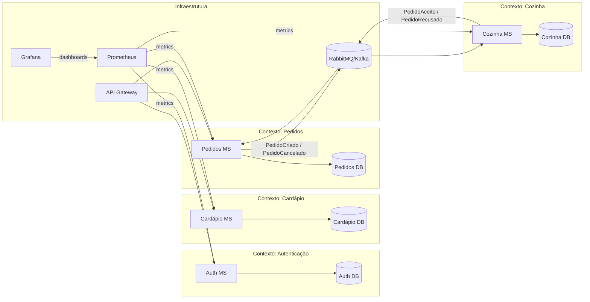

# FastTech Foods – MVP Solution

## Índice

- [Desenho da Solução MVP](#desenho-da-solução-mvp)  
- [Diagrama da Arquitetura da Solução (DDD)](#diagrama-da-arquitetura-da-solução-ddd)  
- [Justificativa Técnica das Decisões Arquiteturais](#justificativa-técnica-das-decisões-arquiteturais)
- [Detalhamento dos microsserviços](#detalhamento-dos-microsserviços)

---

## Desenho da Solução MVP

O MVP é composto por quatro microsserviços independentes, containerizados e orquestrados via Kubernetes, comunicando-se assíncronamente por mensageria. Componentes de suporte garantem segurança, observabilidade e entrega contínua.

- **Microsserviço de Autenticação**  
  - Login de funcionários (e-mail corporativo) e clientes (CPF ou e-mail)  
  - Emissão e validação de JWT  
  - Persistência em banco SQL dedicado  

- **Microsserviço de Cardápio**  
  - CRUD de itens: nome, descrição, preço, disponibilidade  
  - API REST para front-end e outros serviços  
  - Banco SQL próprio  

- **Microsserviço de Pedidos**  
  - Criação, atualização e cancelamento de pedidos  
  - Estados: pendente, em preparo, pronto  
  - Publicação de eventos “PedidoCriado” e “PedidoCancelado”  

- **Microsserviço de Cozinha**  
  - Consome eventos de pedidos  
  - Fluxo de aceite ou rejeição  
  - Emissão de eventos “PedidoAceito” e “PedidoRecusado”  

- **Gateway API**  
  - Ponto único de entrada HTTP  
  - Autenticação, autorização e roteamento de requisições  

- **Mensageria (RabbitMQ ou Kafka)**  
  - Fila de eventos entre Pedidos e Cozinha  
  - Tópicos para notificações em tempo real  

- **Observabilidade**  
  - Zabbix para health checks e alertas  
  - Prometheus Exporter + Grafana para métricas e dashboards  

- **CI/CD**  
  - GitHub Actions ou Azure DevOps  
  - Build, testes automatizados, security scans e deploy no cluster  

---

## Diagrama da Arquitetura da Solução (DDD)

# Justificativa Técnica das Decisões Arquiteturais

## 1. Arquitetura em microsserviços

- Alta coesão e baixo acoplamento de domínios  
- Deploys independentes e escalonamento granular  

## 2. Kubernetes para orquestração

- Escalonamento automático, self-healing e rollouts sem downtime  
- Homogeneidade entre ambientes de dev, staging e produção  

## 3. Mensageria Assíncrona

- Desacoplamento de produtores/consumidores (Pedidos ↔ Cozinha)  
- Tolerância a falhas e retries sem impactar a API  

## 4. API Gateway

- Centralização de segurança (autenticação e autorização)  
- Roteamento e versionamento unificado de APIs  

## 5. Observabilidade Integrada

- Grafana + Prometheus para métricas de performance  
- Dashboards customizáveis e thresholds automáticos  

## 6. CI/CD Automatizado

- Pipeline único: build, testes (unitários, integração e segurança)    

## 7. Persistência por Contexto

- Bancos SQL isolados para consistência transacional  

## 8. Segurança e Compliance

- JWT para autenticação stateless  
- Criptografia em repouso e em trânsito  
- Role-based Access Control (RBAC) no Gateway

---

## Detalhamento dos Microsserviços

A seguir, a função, principais endpoints, persistência e eventos de cada microsserviço do MVP.

---

### 1. Auth MS

Responsabilidades  
- Autenticação de funcionários (e-mail corporativo + senha) e clientes (CPF ou e-mail + senha)  
- Emissão e validação de tokens JWT  
- Refresh de tokens  

Endpoints  
- `POST /api/auth/login` → retorna access + refresh token  
- `POST /api/auth/refresh` → gera novo access token  
- `POST /api/auth/logout` → invalida refresh token  

Persistência  
- Banco SQL (por exemplo, SQL Server)  
- Tabela `Users` (camada de identidade)  
- Tabela `RefreshTokens`  

Eventos  
- Não produz nem consome eventos de domínio via MQ  

---

### 2. Cardápio MS

Responsabilidades  
- CRUD de itens de menu (nome, descrição, preço, disponibilidade)  
- Validação de regras de negócio (preço ≥ 0, nome não vazio)  

Endpoints  
- `GET /api/cardapio` → lista itens com filtros (tipo de refeição)  
- `GET /api/cardapio/{id}` → detalhes de item  
- `POST /api/cardapio` → cria novo item  
- `PUT /api/cardapio/{id}` → edita item existente  
- `DELETE /api/cardapio/{id}` → desativa item  

Persistência  
- Banco SQL dedicado  
- Tabela `MenuItems`  

Eventos  
- Não produz nem consome eventos de domínio via MQ  

---

### 3. Pedidos MS

Responsabilidades  
- Montagem, confirmação e cancelamento de pedidos  
- Cálculo de total e validação de disponibilidade  
- Publicação de eventos de pedido no barramento de mensagens  

Endpoints  
- `POST /api/pedidos` → cria pedido (Producer: `PedidoCriado`)  
- `PATCH /api/pedidos/{id}/cancel` → cancela pedido (Producer: `PedidoCancelado`)  
- `GET /api/pedidos/{id}` → consulta status  

Persistência  
- Banco SQL próprio  
- Tabela `Orders` com colunas: `Id`, `CustomerId`, `Total`, `Status`, `Timestamp`  
- Tabela `OrderItems`  

Eventos  
- **Producer** de:  
  - `PedidoCriado` (quando o cliente confirma)  
  - `PedidoCancelado` (antes do preparo iniciar)  
- **Consumer** de:  
  - `PedidoAceito`  
  - `PedidoRecusado`  

---

### 4. Cozinha MS

Responsabilidades  
- Consumo de novos pedidos para triagem  
- Fluxo de aceite ou rejeição de pedidos  
- Publicação de eventos de decisão para atualização de status  

Endpoints  
- `GET /api/cozinha/pedidos` → lista pedidos pendentes (Consumer de `PedidoCriado`)  
- `POST /api/cozinha/pedidos/{id}/decisao` → aceita ou recusa (Producer: `PedidoAceito` ou `PedidoRecusado`)  

Persistência  
- Banco SQL separado  
- Tabela `KitchenOrders` (espelho de `Orders`)  
- Tabela `DecisionLogs`  

Eventos  
- **Consumer** de:  
  - `PedidoCriado`  
  - `PedidoCancelado`  
- **Producer** de:  
  - `PedidoAceito`  
  - `PedidoRecusado`  

