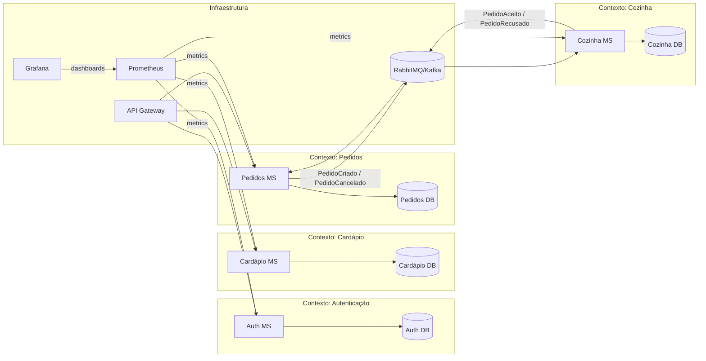

# FastTech Foods – MVP Solution

## Índice

- [Linguagem Ubíqua](#linguagem-ubíqua)
- [Desenho da Solução MVP](#desenho-da-solução-mvp)  
- [Diagrama da Arquitetura da Solução (DDD)](#diagrama-da-arquitetura-da-solução-ddd)  
- [Justificativa Técnica das Decisões Arquiteturais](#justificativa-técnica-das-decisões-arquiteturais)
- [Detalhamento dos microsserviços](#detalhamento-dos-microsserviços)
- [Script Mysql](#script-mysql--fasttech-foods)

---

## Linguagem Ubíqua

This project leverages a shared vocabulary between developers and domain experts to ensure clarity and alignment:

- Cliente (Customer)  
- Funcionário (Employee)  
- Gerente (Manager)  
- Cardápio (Menu)  
- Pedido (Order)  
- Entrega (Delivery)  
- Autenticação (Authentication)  
- Disponibilidade (Availability)  

---

## System Contexts

### Client Side

- Cadastro do Cliente: registro via e-mail ou CPF  
- Autenticação do Cliente: e-mail ou CPF + senha  
- Catálogo Online: visualização e busca de produtos  
- Montagem de Pedido: seleção de itens, cálculo de total, escolha de modalidade de entrega  

### Employee Side

- Autenticação do Funcionário: e-mail corporativo + senha  
- Gerência de Cardápio: cadastrar, editar nome, descrição, preço e disponibilidade  
- Equipe de Cozinha: recepção de pedidos, opção de aceitar ou recusar  

---

## Actors

- Chefe da Cozinha  
- Gerente do FastTech Foods  
- Atendente (Balcão)  
- Atendente (Drive-Thru)  
- Entregador (Delivery)  

---

## Features

### Cliente

1. Cadastro de conta  
2. Login via e-mail ou CPF  
3. Busca e filtragem de produtos (lanche, sobremesa, bebida)  
4. Montagem de pedido e visualização de total  
5. Seleção de modalidade de entrega (balcão, drive-thru, delivery)  

### Funcionário

1. Login com e-mail corporativo  
2. Gerente: gerenciamento de itens do cardápio  
3. Cozinha: visualização e tratamento de pedidos  

---

## Menu de Produtos

### Lanches (Hambúrguer)

| Item               | Ingredientes                                                                 |
|--------------------|-------------------------------------------------------------------------------|
| X Bacon            | Alface, Tomate, Hambúrguer, Presunto, Mussarela, Bacon                        |
| Bacon Especial     | Alface, Tomate, Batata Palha, Milho, Hambúrguer, Presunto, Mussarela, Bacon   |
| X-Frango           | Alface, Tomate, Batata Palha, Milho, Filé de Frango, Presunto, Mussarela, Bacon |
| Frango Especial    | Alface, Tomate, Batata Palha, Milho, Filé de Frango, Presunto, Mussarela, Bacon, Salsicha, Ovo |
| Especiais          | Alface, Tomate, Batata Palha, Milho, Hambúrguer, Mussarela, Bacon             |
| Bacon Mega         | Alface, Tomate, Batata Palha, Milho, Hambúrguer, Presunto, Mussarela, Bacon, Salsicha, Ovo |
| X-Frango Turbo     | Alface, Tomate, Batata Palha, Milho, Filé de Frango, Presunto, Mussarela, Bacon |

### Esfihas

| Item         | Ingredientes            |
|--------------|-------------------------|
| Carne Seca   | Carne, Mussarela        |
| Calabresa    | Calabresa, Cebola       |
| Bauru        | Presunto, Queijo, Tomate|
| Pizza        | Queijo, Tomate, Orégano |
| Bacon        | Bacon, Queijo           |
| Atum         | Atum, Cebola            |
| Dois Queijos | Mussarela, Requeijão    |

### Sobremesas (Sorvete)

| Item                  | Ingredientes             |
|-----------------------|--------------------------|
| Ice Cream             | Vanilla                  |
| Chocolate             | Chocolate                |
| Strawberry            | Morango, Calda de Morango|
| Napolitano            | Morango, Chocolate       |
| Baunilha c/ Chocolate | Baunilha, Chocolate      |
| Brigadeiro            | Chocolate, Brigadeiro    |
| Maracujá              | Maracujá                 |

### Bebidas

| Item                       | Observações |
|----------------------------|-------------|
| Água Mineral com Gás       | —           |
| Água Mineral sem Gás       | —           |
| Schweppes Citrus           | —           |
| Coco Verde                 | —           |
| Coca-Cola Lata             | —           |
| Heineken Lata              | —           |
| Skol Lata                  | —           |

---

## Bounded Contexts & Context Map

- Cliente Context: cadastro, busca, pedido  
- Cardápio Context: definição e edição de itens  
- Cozinha Context: aceitação e rejeição de pedidos  
- Atendimento Context: balcão, drive-thru, delivery  

O mapeamento de contextos garante que cada parte do sistema tenha responsabilidades bem definidas e minimize dependências entre equipes de desenvolvimento.

---

## Desenho da Solução MVP

O MVP é composto por quatro microsserviços independentes, containerizados e orquestrados via Kubernetes, comunicando-se assíncronamente por mensageria. Componentes de suporte garantem segurança, observabilidade e entrega contínua.

- **Microsserviço de Autenticação**  
  - Login de funcionários (e-mail corporativo) e clientes (CPF ou e-mail)  
  - Emissão e validação de JWT  
  - Persistência em banco SQL dedicado  

- **Microsserviço de Cardápio**  
  - CRUD de itens: nome, descrição, preço, disponibilidade  
  - API REST para front-end e outros serviços  
  - Banco SQL próprio  

- **Microsserviço de Pedidos**  
  - Criação, atualização e cancelamento de pedidos  
  - Estados: pendente, em preparo, pronto  
  - Publicação de eventos “PedidoCriado” e “PedidoCancelado”  

- **Microsserviço de Cozinha**  
  - Consome eventos de pedidos  
  - Fluxo de aceite ou rejeição  
  - Emissão de eventos “PedidoAceito” e “PedidoRecusado”  

- **Gateway API**  
  - Ponto único de entrada HTTP  
  - Autenticação, autorização e roteamento de requisições  

- **Mensageria (RabbitMQ ou Kafka)**  
  - Fila de eventos entre Pedidos e Cozinha  
  - Tópicos para notificações em tempo real  

- **Observabilidade**  
  - Prometheus Exporter + Grafana para métricas e dashboards  

- **CI/CD**  
  - GitHub Actions ou Azure DevOps  
  - Build, testes automatizados, security scans e deploy no cluster  

---

## Diagrama da Arquitetura da Solução (DDD)



# Justificativa Técnica das Decisões Arquiteturais

## 1. Arquitetura em microsserviços

- Alta coesão e baixo acoplamento de domínios  
- Deploys independentes e escalonamento granular  

## 2. Kubernetes para orquestração

- Escalonamento automático, self-healing e rollouts sem downtime  
- Homogeneidade entre ambientes de dev, staging e produção  

## 3. Mensageria Assíncrona

- Desacoplamento de produtores/consumidores (Pedidos ↔ Cozinha)  
- Tolerância a falhas e retries sem impactar a API  

## 4. API Gateway

- Centralização de segurança (autenticação e autorização)  
- Roteamento e versionamento unificado de APIs  

## 5. Observabilidade Integrada

- Grafana + Prometheus para métricas de performance  
- Dashboards customizáveis e thresholds automáticos  

## 6. CI/CD Automatizado

- Pipeline único: build, testes (unitários, integração e segurança)    

## 7. Persistência por Contexto

- Bancos SQL isolados para consistência transacional  

## 8. Segurança e Compliance

- JWT para autenticação stateless  
- Criptografia em repouso e em trânsito  
- Role-based Access Control (RBAC) no Gateway

---

## Detalhamento dos Microsserviços

A seguir, a função, principais endpoints, persistência e eventos de cada microsserviço do MVP.

---

### 1. Auth MS

Responsabilidades  
- Autenticação de funcionários (e-mail corporativo + senha) e clientes (CPF ou e-mail + senha)  
- Emissão e validação de tokens JWT  
- Refresh de tokens  

Endpoints  
- `POST /api/auth/login` → retorna access + refresh token  
- `POST /api/auth/refresh` → gera novo access token  
- `POST /api/auth/logout` → invalida refresh token  

Persistência  
- Banco SQL (por exemplo, Mysql)  
- Tabela `Users` (camada de identidade)  
- Tabela `RefreshTokens`  

Eventos  
- Não produz nem consome eventos de domínio via MQ  

---

### 2. Cardápio MS

Responsabilidades  
- CRUD de itens de menu (nome, descrição, preço, disponibilidade)  
- Validação de regras de negócio (preço ≥ 0, nome não vazio)  

Endpoints  
- `GET /api/cardapio` → lista itens com filtros (tipo de refeição)  
- `GET /api/cardapio/{id}` → detalhes de item  
- `POST /api/cardapio` → cria novo item  
- `PUT /api/cardapio/{id}` → edita item existente  
- `DELETE /api/cardapio/{id}` → desativa item  

Persistência  
- Banco SQL dedicado  
- Tabela `MenuItems`  

Eventos  
- Não produz nem consome eventos de domínio via MQ  

---

### 3. Pedidos MS

Responsabilidades  
- Montagem, confirmação e cancelamento de pedidos  
- Cálculo de total e validação de disponibilidade  
- Publicação de eventos de pedido no barramento de mensagens  

Endpoints  
- `POST /api/pedidos` → cria pedido (Producer: `PedidoCriado`)  
- `PATCH /api/pedidos/{id}/cancel` → cancela pedido (Producer: `PedidoCancelado`)  
- `GET /api/pedidos/{id}` → consulta status  

Persistência  
- Banco SQL próprio  
- Tabela `Orders` com colunas: `Id`, `CustomerId`, `Total`, `Status`, `Timestamp`  
- Tabela `OrderItems`  

Eventos  
- **Producer** de:  
  - `PedidoCriado` (quando o cliente confirma)  
  - `PedidoCancelado` (antes do preparo iniciar)  
- **Consumer** de:  
  - `PedidoAceito`  
  - `PedidoRecusado`  

---

### 4. Cozinha MS

Responsabilidades  
- Consumo de novos pedidos para triagem  
- Fluxo de aceite ou rejeição de pedidos  
- Publicação de eventos de decisão para atualização de status  

Endpoints  
- `GET /api/cozinha/pedidos` → lista pedidos pendentes (Consumer de `PedidoCriado`)  
- `POST /api/cozinha/pedidos/{id}/decisao` → aceita ou recusa (Producer: `PedidoAceito` ou `PedidoRecusado`)  

Persistência  
- Banco SQL separado  
- Tabela `KitchenOrders` (espelho de `Orders`)  
- Tabela `DecisionLogs`  

Eventos  
- **Consumer** de:  
  - `PedidoCriado`  
  - `PedidoCancelado`  
- **Producer** de:  
  - `PedidoAceito`  
  - `PedidoRecusado` 

---

## Script MySQL – FastTech Foods

```sql
-- 1. Usuários (autenticação)
CREATE TABLE IF NOT EXISTS users (
  id BIGINT UNSIGNED AUTO_INCREMENT PRIMARY KEY,
  email VARCHAR(255) NOT NULL UNIQUE,
  cpf CHAR(11) UNIQUE,
  password_hash VARCHAR(255) NOT NULL,
  role ENUM('CLIENTE','ATENDENTE','GERENTE','COZINHEIRO') NOT NULL,
  created_at TIMESTAMP NOT NULL DEFAULT CURRENT_TIMESTAMP,
  updated_at TIMESTAMP NOT NULL 
    DEFAULT CURRENT_TIMESTAMP 
    ON UPDATE CURRENT_TIMESTAMP
) ENGINE=InnoDB;


-- 2. Itens de Cardápio
CREATE TABLE IF NOT EXISTS menu_items (
  id BIGINT UNSIGNED AUTO_INCREMENT PRIMARY KEY,
  name VARCHAR(150) NOT NULL,
  description TEXT,
  price DECIMAL(10,2) NOT NULL CHECK (price >= 0),
  meal_type ENUM('LANCHES','SOBREMESAS','BEBIDAS') NOT NULL,
  available BOOLEAN NOT NULL DEFAULT TRUE,
  created_at TIMESTAMP NOT NULL DEFAULT CURRENT_TIMESTAMP,
  updated_at TIMESTAMP NOT NULL 
    DEFAULT CURRENT_TIMESTAMP 
    ON UPDATE CURRENT_TIMESTAMP,
  INDEX idx_menu_meal_type (meal_type)
) ENGINE=InnoDB;


-- 3. Pedidos
CREATE TABLE IF NOT EXISTS orders (
  id BIGINT UNSIGNED AUTO_INCREMENT PRIMARY KEY,
  customer_id BIGINT UNSIGNED NOT NULL,
  delivery_method 
    ENUM('BALCAO','DRIVE_THRU','DELIVERY') NOT NULL,
  total DECIMAL(10,2) NOT NULL CHECK (total >= 0),
  status 
    ENUM('PENDENTE','EM_PREPARO','PRONTO','CANCELADO') 
    NOT NULL DEFAULT 'PENDENTE',
  cancel_reason TEXT NULL,
  created_at TIMESTAMP NOT NULL DEFAULT CURRENT_TIMESTAMP,
  updated_at TIMESTAMP NOT NULL 
    DEFAULT CURRENT_TIMESTAMP 
    ON UPDATE CURRENT_TIMESTAMP,
  FOREIGN KEY (customer_id) 
    REFERENCES users(id) 
    ON DELETE RESTRICT,
  INDEX idx_orders_status (status),
  INDEX idx_orders_created (created_at)
) ENGINE=InnoDB;


-- 4. Itens do Pedido
CREATE TABLE IF NOT EXISTS order_items (
  id BIGINT UNSIGNED AUTO_INCREMENT PRIMARY KEY,
  order_id BIGINT UNSIGNED NOT NULL,
  menu_item_id BIGINT UNSIGNED NOT NULL,
  quantity INT UNSIGNED NOT NULL CHECK (quantity > 0),
  price_at_order DECIMAL(10,2) NOT NULL CHECK (price_at_order >= 0),
  total_item DECIMAL(10,2) 
    GENERATED ALWAYS AS (quantity * price_at_order) STORED,
  created_at TIMESTAMP NOT NULL DEFAULT CURRENT_TIMESTAMP,
  FOREIGN KEY (order_id) 
    REFERENCES orders(id) 
    ON DELETE CASCADE,
  FOREIGN KEY (menu_item_id) 
    REFERENCES menu_items(id) 
    ON DELETE RESTRICT,
  INDEX idx_order_items_menu (menu_item_id),
  INDEX idx_order_items_order (order_id)
) ENGINE=InnoDB;


-- 5. Eventos da Cozinha (aceite ou recusa)
CREATE TABLE IF NOT EXISTS kitchen_events (
  id BIGINT UNSIGNED AUTO_INCREMENT PRIMARY KEY,
  order_id BIGINT UNSIGNED NOT NULL,
  action ENUM('ACEITO','RECUSADO') NOT NULL,
  justification TEXT NULL,
  created_at TIMESTAMP NOT NULL DEFAULT CURRENT_TIMESTAMP,
  FOREIGN KEY (order_id) 
    REFERENCES orders(id) 
    ON DELETE CASCADE,
  INDEX idx_kitchen_events_order (order_id)
) ENGINE=InnoDB;

```


